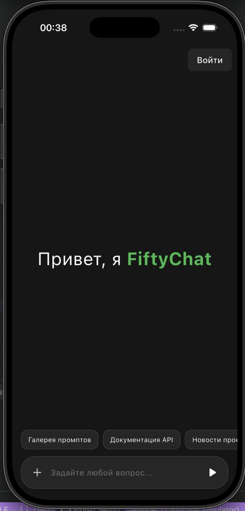

# FiftyChat 💬

A cross-platform mobile application for [chat.fifty.su](https://chat.fifty.su) — a real-time messaging platform.



## Features

- 💬 Real-time messaging via the fifty.su API
- 📱 Cross-platform: Android & iOS
- 🔔 Chat notifications
- 🧭 Clean and simple UI

## Tech Stack

| Technology | Purpose |
|---|---|
| Flutter / Dart | Cross-platform mobile framework |
| C++ | Native platform integration |
| Swift | iOS-specific components |
| REST API | Communication with chat.fifty.su |

## Getting Started

### Prerequisites

- Flutter SDK 3.x+
- Android Studio or Xcode

### Installation

```bash
git clone https://github.com/Ab4kshin/fifty-chat.git
cd fifty-chat/fifty_chat
flutter pub get
flutter run
```

## Download

📦 [Download latest release (APK)](https://github.com/Ab4kshin/fifty-chat/releases/tag/Release)

## License

MIT License — see [LICENSE](LICENSE) for details.
